# Create a Challenge on Codabench

This repository is for **challenge organizers** to organize a challenge on [Codabench](https://www.codabench.org/).


This repository has a sample `starting_kit` which provides a template of how you can design yours.

A sample `competition_bundle` is provided as a template bundle which works perfectly on Codabench.

A sample challenge with the `competition_bundle` in this repository is given here: [Sample Challenge](https://www.codabench.org/).


***

<br><br><br>


# Table of Contents
1. [Understanding the Starting Kit](#understanding_the_starting_kit)
2. [Understanding the Compatition Bundle](#understanding_the_competition_bundle)
2. [Instructions about datasets](#instructions_about_datasets) 
3. [How to create a challenge on Codabench?](#how_to_create_a_challenge_on_codabench) 
4. [How to upload datasets on Codabench?](#how_to_upload_datasets_on_codabench) 
5. [How to create a task on Codabench?](#how_to_create_a_task_on_codabench) 
6. [How to change a task in a competition?](#how_to_change_a_task_in_a_competition) 


***

<br><br><br>


# Understanding the Starting Kit <a name="understanding_the_starting_kit"></a>

The starting kit consists of the following directories and files:

1. `ingestion_program`  
This directory consists of the following files:
    - `data_io.py` : contains functions to load the data
    - `ingestion.py` : responsible for loading, running the model with the input data and to save the results in the results directory
    - `metadata` : a file required to run the code on Codabench 


2. `scoring_program`  
This directory consists of the following files:
    - `metric.txt` : a text file which consists of the name of the metric of evaluation
    - `solution.py` : to load only the solutions from the input data
    - `score.py` : responsible to compute score from the predictions made by `ingestion.py` and ground truths from `solution.py`
    - `libscores.py` : consists of pre-defined metrics 
    - `my_metric.py`: a file in which you can define your own custom metric or use any metric from a library e.g. scikit-learn
    - `metadata` : a file required to run the code on Codabench 


3. `scoring_output`  
This directory consists of `scores.html` and `scores.txt` files. These files are used to store scores from scoring program and to load scores to the leader board


4. `sample_data`  
This directory contains the sample data (a subset of *Dataset 0*) for the challenge.


5. `sample_code_submission`  
This directory consists of `model.py` file which has a Model Class with different functions. You have to change this file but the names of the functions should be the same. You can also keep a pre-trained model in this directory which could be used as a pre-trained model when you submit a code submission.


6. `sample_result_submission`  
This directory contains `train.predict` and `test.predict` files which are used to calculate the score. 


7. `logo.png`  
This image is the logo for your competition on Codabench website.

9. `README.ipynb`  
This is python notebook which gives the participants a tour from data loading to code submission on Codabench.

⚠️ Check the example `starting_kit` in this repository

***

<br><br><br>


# Understanding the Compatition Bundle <a name="understanding_the_competition_bundle"></a>

The `competition_bundle` consists of all the files and folders from `starting_kit` along with the following additional files.

1. `competition.yaml`  
This file consists of important details and settings of the competition which include:
 - title
 - description
 - image
 - end date
 - documentation pages
 - phases
 - tasks
 - leaderboard

See the example `competition.yaml` file in the `competition_bundle`

2. `documentation pages`  
There are several documentation pages to describe the competition:
 - overview.md
 - evaluation.md
 - data.md
 - terms.md


⚠️ Check the example `competition_bundle` in this repository

***

<br><br><br>


# Instructions about datasets <a name="instructions_about_datasets"></a>

The challenge consists of two phases:  
- `Phase 1` (Feedback Phase)
- `Phase 2` (Final Phase)


This challenge is designed for a triplet of datasets:  
- `Dataset 0` (to be used as `public_data`)
- `Dataset 1` (to be used in `Phase 1`)
- `Dataset 2` (be used in `Phase 2`)


⚠️ Check the example `datasets` in this repository


***

<br><br><br>

# How to create a challenge on Codabench? <a name="how_to_create_a_challenge_on_codabench"></a>

Follow the steps below to create a challenge on [Codabench](https://www.codabench.org/).  


### Step 1 : Clone this repository

``` 
git clone https://github.com/ihsaan-ullah/create_a_codabench_challenge.git
```


### Step 2 : Zip Competition Bundle

1. Go the repository
``` 
cd create_a_codabench_challenge
```

2. Zip the competition bundle
```
zip -r competition_bundle.zip competition_bundle/*
```

### Step 3 : Sign Up on Codabench

1. Create an account on the Codabench Website: https://www.codabench.org/accounts/signup


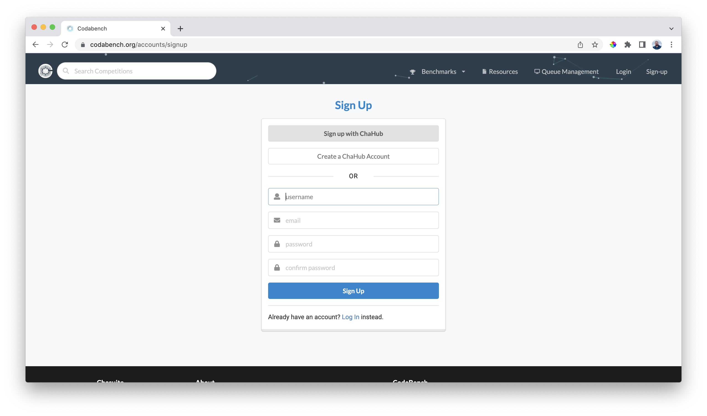


### Step 4 : Login on Codabench

1. Login into your account : https://www.codabench.org/accounts/login/

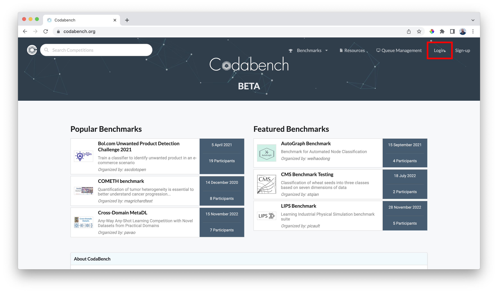

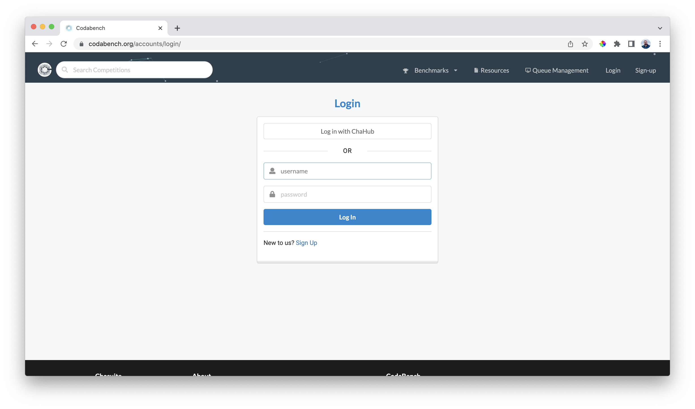


### Step 2 : Upload Bundle

1. Click `Management` under Benchmarks in the Navigation bar
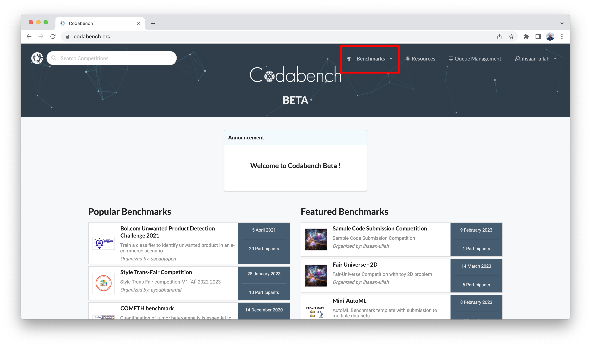

2. Click `Upload` button
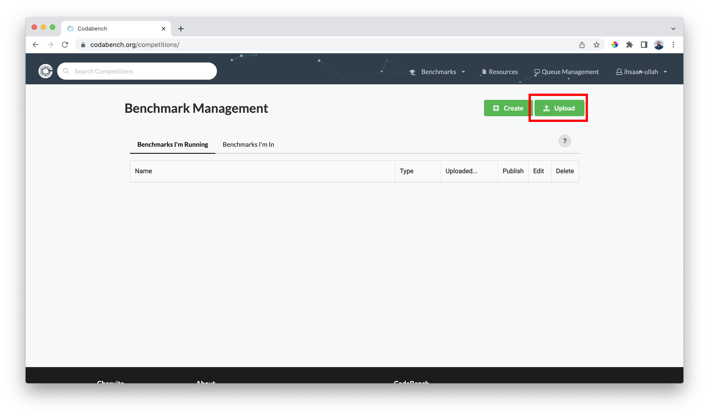

3. Click the input file field  
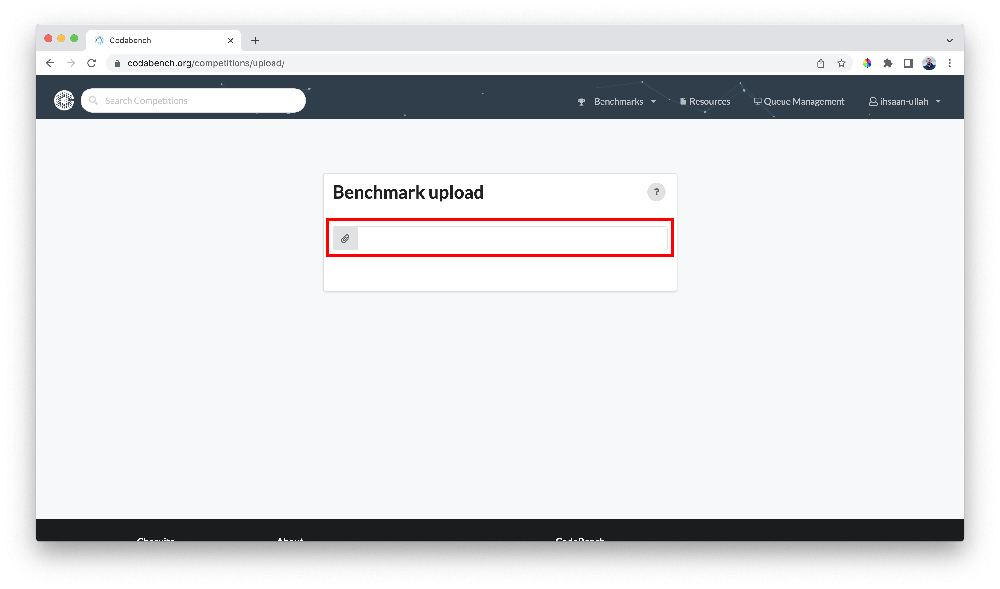

4. Choose the `competition_bundle.zip` created in ***Step 2***

5. Click `View` to see the uploaded competition
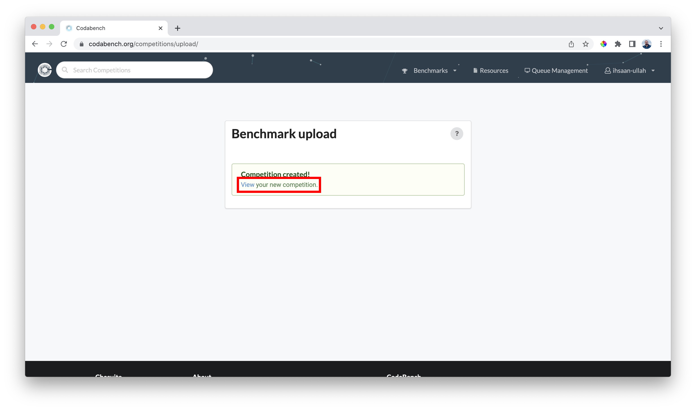


##### ⚠️ Note  
You have to make changes according to the specifications and goals of your challenge before uploading it to Codabench.

***

<br><br><br>


# How to upload datasets on Codabench? <a name="how_to_upload_datasets_on_codabench"></a>

Follow the steps below to upload Public Data (`Dataset 0`) and Input/Reference Data (`Dataset 1` and `Dataset 2`) to Codabench 

1. Click `Resources` in the top navigation bar
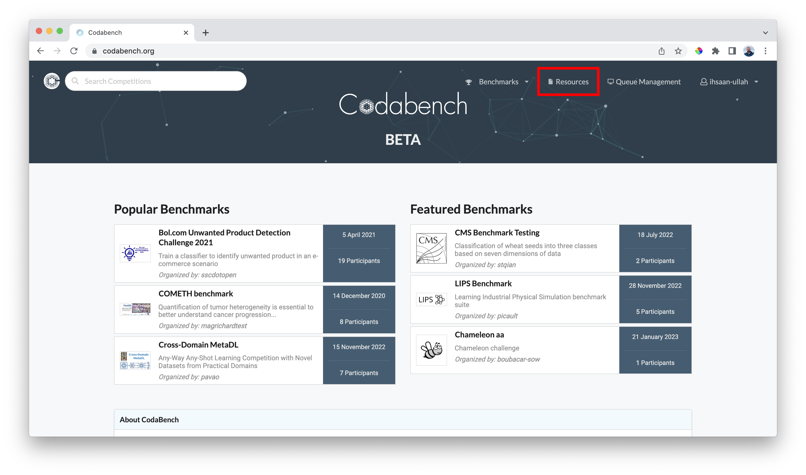

2. Click `Add Dataset` button
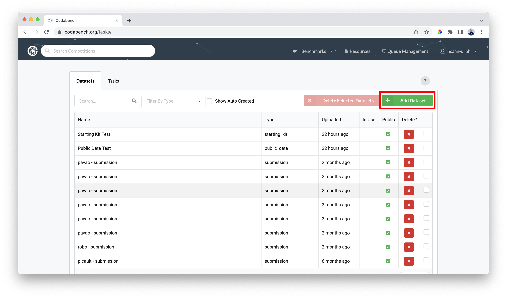

3. Fill the form by entering the following details:
    - Name
    - Description
    - Select type
        - Ingestion Program
        - Input Data
        - Public Data
        - Reference Data
        - Scoring Program
        - Starting Kit 
        - Submission
    - Select the zipped dataset and click upload

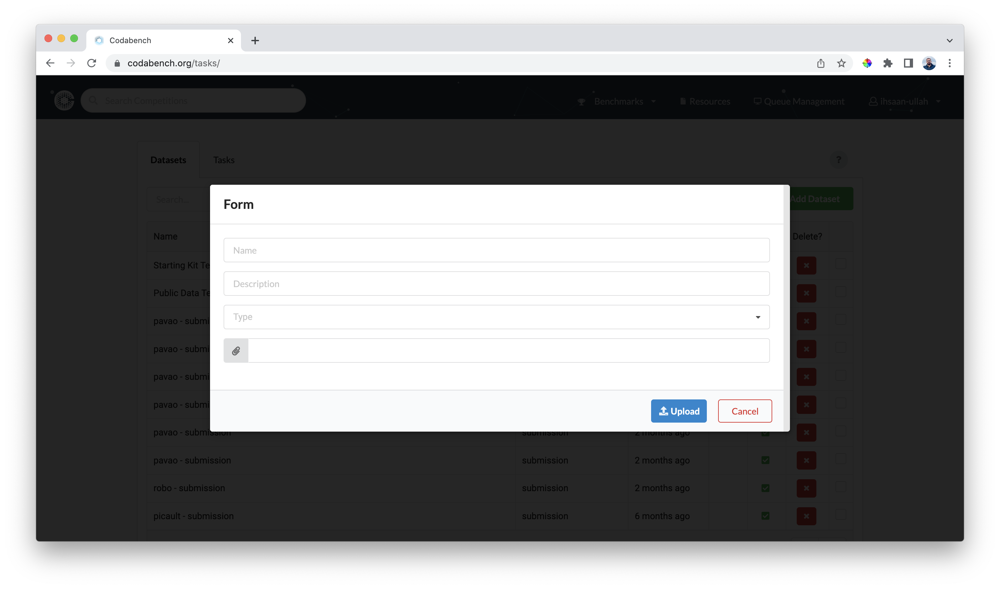


4. Click `Upload` button to save changes.


##### ⚠️ Note  
- For Public Data (`Dataset 0`) choose the type *Public Data*
- For Input Data (`Dataset 1`, `Dataset 2`) choose *Input Data*
- Choose other types for `scoring_program`, `ingestion_program` or `starting_kit`.


***

<br><br><br>


# How to create a task on Codabench? <a name="how_to_create_a_task_on_codabench"></a>

1. Click `Resources` in the top navigation bar


2. Click `Tasks` tab
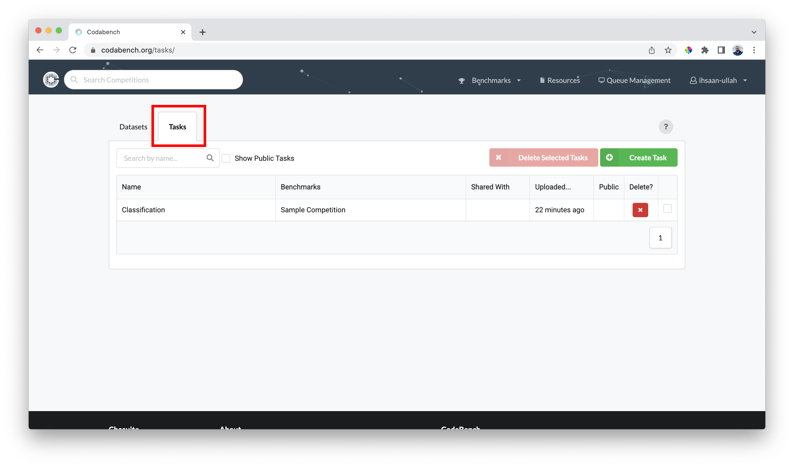

3. Click `Create Task` button
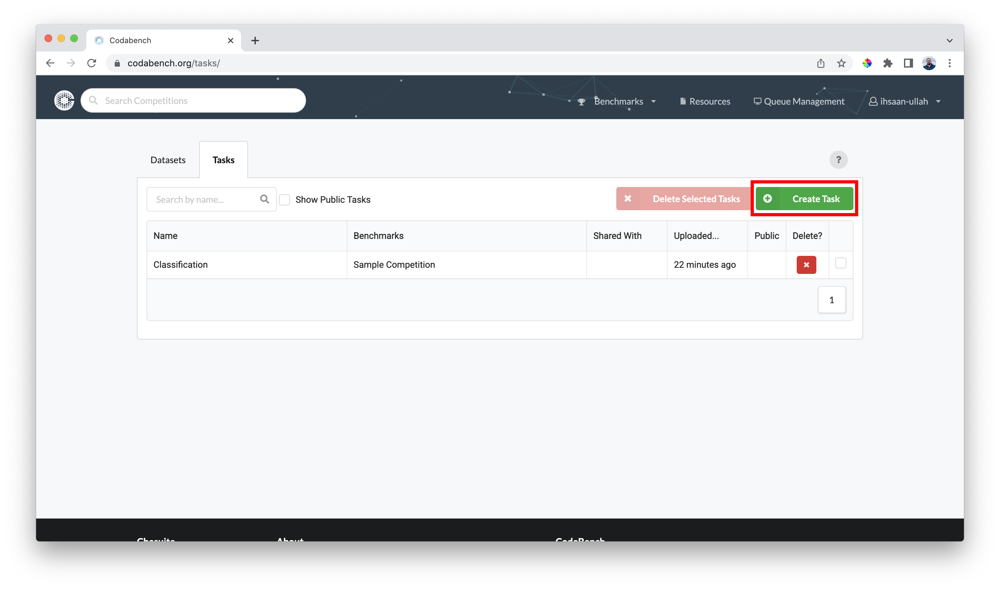

4. Fill the form by entering ***Name*** and ***Description*** in Details tab and selecting ***Scoring Program***, ***Ingestion Program***, ***Reference Data***, and ***Input Data*** from the uploaded Datasets.
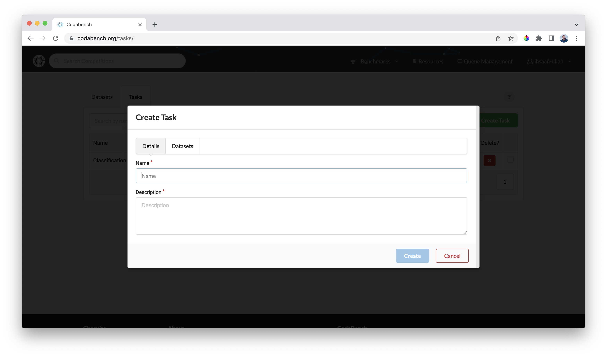

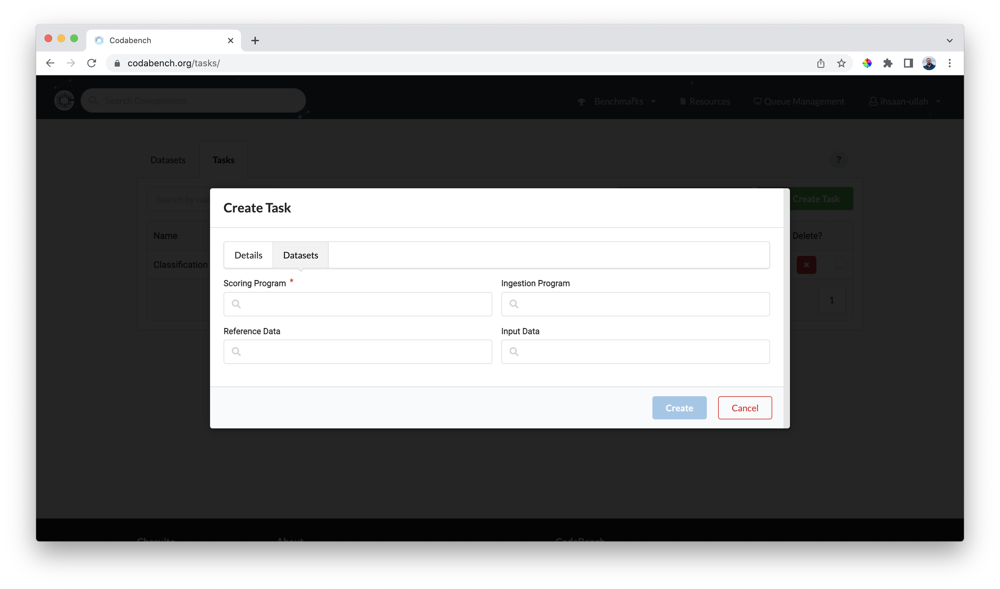

5. Click `Create` button to save changes.

***

<br><br><br>

# How to change a task in a competition? <a name="how_to_change_a_task_in_a_competition"></a>

Follow the steps below to change a task in your competition.

1. Click `Management` under Benchmarks in the Navigation bar


2. Click the `Edit` button in front of the competition you want to edit
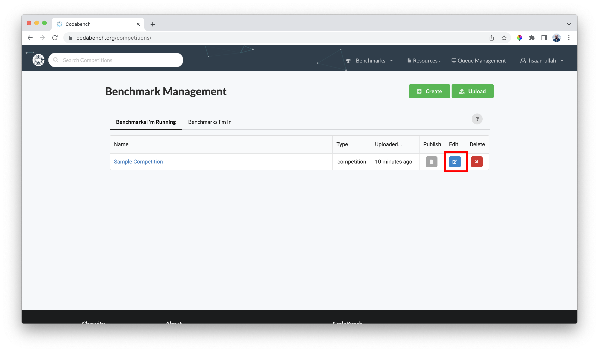

3. Click the `Edit` button in front of the phase for which you want to change the task
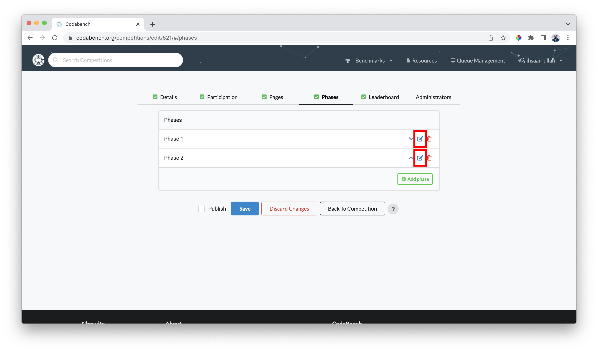

4. Click the tasks dropdown to select a new task. You can remove existing task by clickin the cross button
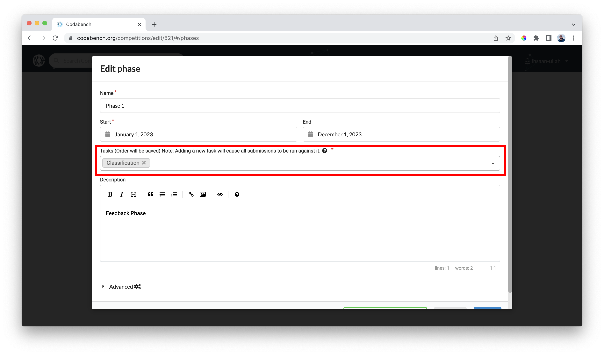

5. Click the `Save` button at the bottom of the page to save changes.


***

<br><br><br>


## Contact 
In case of any confusion, contact by email : ihsan2131@gmail.com

## Bugs/Issues
Report any inconsistencies or bugs on Codabench Github: https://github.com/codalab/codabench/issues


